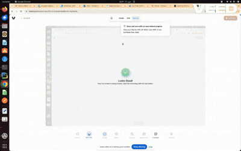

🌐 **FastMCP - Multi-Cloud FinOps Copilot**

An MCP (Model Context Protocol) server that connects Gemini-powered assistants with FinOps insights across AWS, GCP, and Azure. Perform natural language-based cost breakdowns, audits, and usage summaries — all locally and securely.

---

## 📌 Why Use FastMCP?

Managing multi-cloud costs is complex. FastMCP allows you to:

* Ask AI "How much did we spend on Azure last month?"
* Run a cost-saving audit across AWS and GCP in one prompt
* Receive budget summaries from all major cloud providers

Powered by **LangChain**, **LangGraph**, and **Gemini Pro**, this tool makes FinOps conversational and cross-platform.

---

## 🎥 Demo Videos

**Getting Started with FastMCP:**
https://www.loom.com/share/0d875df356574d31a2ea16c8d809b2dc

**Advanced FinOps Analysis:**
https://www.loom.com/share/54ecf1a34d6d42ce9ea35c8d160a676f


---

## 🚀 Features

* 🌍 Supports AWS, GCP, Azure
* 🧠 Natural language queries via Gemini Pro
* 🧰 Cost breakdowns, FinOps audits, budget status
* ⚙️ CLI or FastAPI-compatible architecture
* 🧰 Quick analysis with actionable recommendations for high-cost resources.
* 🛡️ Credentials never leave your machine (uses local SDK/CLI auth)

---

## 🧱 Installation

### 1. Prerequisites

* Python 3.11+
* poetry
* CLI tools:

  * aws CLI (for AWS)
  * gcloud CLI (for GCP)
  * az CLI (for Azure)

### 2. Clone & Setup

```bash
git clone https://github.com/Eazy-Ops/multi-cloud-finops-mcp-server.git
cd multi-cloud-finops-mcp-server

# Install dependencies
poetry install

# activate virtualenv created by poetry
poetry shell
```

---

## 🔐 Authentication Setup

### 🔹 AWS

```bash
aws configure --profile your-profile
```

You'll be prompted for:

* Access Key ID
* Secret Access Key
* Region
* Output format (e.g. json)

### 🔹 GCP

**Option 1: Use Application Default Credentials (ADC)**

```bash
gcloud auth application-default login
```

**Option 2: Use Service Account JSON**

Pass the file path to `service_account_key_path` when calling GCP functions.

### 🔹 Azure

```bash
az login
```

**For service principal auth (optional):**

```bash
export AZURE_TENANT_ID=your-tenant-id
export AZURE_CLIENT_ID=your-client-id
export AZURE_CLIENT_SECRET=your-client-secret
```

---

## 🧪 Usage

### CLI Entry Point

```bash
poetry run python -m mcp.server.fastmcp
```
### 🔹 OR
```bash
python main.py
```

Then ask questions in Claude Desktop, Amazon Q, or any MCP-compatible client:

* "Run a FinOps audit for AWS us-east-1 profile"
* "Get last 30 days GCP cost breakdown for my service account"
* "How many stopped Azure VMs in west-europe?"

---

## 💬 Example Prompts

### 📊 AZURE finops audit for subscription_id id

```json
{
  "audit": {
    "stopped_vms": [
      {"name": "vm-dev-1", "region": "eastus", "status": "Stopped"}
    ],
    "unattached_disks": [
      {"id": "disk-abc", "size_gb": 100}
    ]
  }
}
```

### 💸 AWS cost break down for the current month profile any_locally_configured_profile

```json
{
  "total_cost": 124.50,
  "grouped_by_service": {
    "Amazon EC2": 78.23,
    "Amazon S3": 32.91,
    "CloudWatch": 13.36
  }
}
```

### 💸 AWS rds instances having cpu utilization under 2 percent
```bash


Following RDS instances have CPU utilization under 2 percent:

* resource_name1 (1.73%)
* resource_name2 (1.2%)

```


### ☁️ Break down GCP spend in last 7 days project id project_id

```json
{
  "project_id": "my-gcp-project",
  "cost_breakdown": {
    "Compute Engine": 41.50,
    "BigQuery": 88.75
  }
}
```

---

## 🧪 Testing

The project includes comprehensive unit tests for all cloud provider tools. Tests are organized by cloud provider and cover both success and error handling scenarios.

### Running Tests

#### Run All Tests
```bash
python run_tests.py
```

#### Run Tests for Specific Cloud Provider

**AWS Tests:**
```bash
python run_tests.py aws
```

**GCP Tests:**
```bash
python run_tests.py gcp
```

**Azure Tests:**
```bash
python run_tests.py azure
```

#### Run Individual Test Files

**AWS Tools:**
```bash
python -m unittest tests.test_aws_tools
```

**GCP Tools:**
```bash
python -m unittest tests.test_gcp_tools
```

**Azure Tools:**
```bash
python -m unittest tests.test_azure_tools
```

#### Run Specific Test Methods
```bash
python -m unittest tests.test_aws_tools.TestAWSTools.test_analyze_aws_disks_success
```

#### Run test cases for Specific cloud [aws, gcp, azure]
```bash
python run_tests.py aws
```

### Test Coverage

The test suite covers:

* **Success Scenarios**: Testing tool functionality with valid inputs and mocked cloud responses
* **Error Handling**: Testing graceful handling of API failures, authentication errors, and network issues
* **Parameter Validation**: Ensuring tools handle various input parameters correctly
* **Mock Integration**: Using mocked cloud SDK clients to avoid actual API calls during testing

### Test Structure

```
tests/
├── test_aws_tools.py      # AWS FinOps tools tests
├── test_gcp_tools.py      # GCP FinOps tools tests
├── test_azure_tools.py    # Azure FinOps tools tests
└── run_tests.py          # Test runner script
```

### Test Dependencies

Tests use the following mocking strategies:
- **AWS**: Mocks boto3 session and client methods
- **GCP**: Mocks Google Cloud client libraries and service methods
- **Azure**: Mocks Azure SDK clients and management operations

All tests are designed to run without requiring actual cloud credentials or making real API calls.

## License

This project is licensed under the MIT License. See the [LICENSE](LICENSE) file for details.

## Contributing

We welcome contributions from the community! Please see our [contributing guidelines](CONTRIBUTING.md) for more information.

When submitting a pull request, please use our [pull request template](/.github/pull_request_template.md) to help us review your contribution.

## Code of Conduct

We have a [code of conduct](CODE_OF_CONDUCT.md) that we expect all contributors to follow. Please read it before contributing.

## 🐳 Running with Docker Compose

You can run FastMCP using Docker Compose for easy setup and isolation.

### 1. Build the Docker image

```bash
docker compose build
```

### 2. Run the FinOps CLI

```bash
docker compose run finops-cli
```

You can now enter prompts just as you would with the CLI

---

